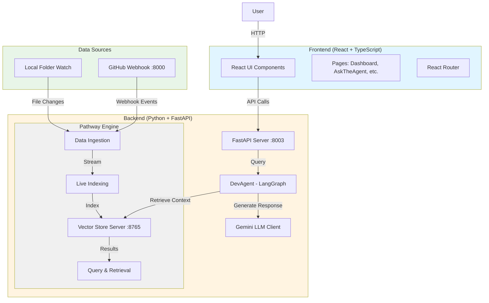

# Pathway-Hack Architecture Documentation

This document contains Mermaid diagrams to visualize the architecture, data flow, and components of the Pathway-Hack system.

## Table of Contents
1. [System Architecture Overview](#system-architecture-overview)
2. [Data Flow Diagram](#data-flow-diagram)
3. [Agent Workflow (LangGraph)](#agent-workflow-langgraph)
4. [Backend Component Structure](#backend-component-structure)
5. [Frontend Component Structure](#frontend-component-structure)
6. [Pathway Engine Pipeline](#pathway-engine-pipeline)
7. [API Interaction Flow](#api-interaction-flow)

---

## System Architecture Overview

High-level architecture showing the main components and their relationships.



---

## Data Flow Diagram

Shows how data flows through the system from ingestion to user response.


---

## Agent Workflow (LangGraph)

The DevAgent uses LangGraph to orchestrate a multi-step reasoning process.

```mermaid
graph TD
    Start([User Query]) --> Observe[🔍 Observe Node]
    Observe -->|Retrieve & Build Context| Plan[🧠 Plan Node]
    
    Plan -->|Analyze Query| Route{Tools Needed?}
    
    Route -->|Yes| Tools[🛠️ Use Tools Node]
    Route -->|No| Generate[💬 Generate Node]
    
    Tools -->|Tool Results| Generate
    
    Generate -->|Create Response| Assess[📊 Assess Confidence Node]
    Assess -->|Calculate Score| Format[✨ Format Output Node]
    Format --> End([Return Result])
    
    style Observe fill:#e3f2fd
    style Plan fill:#fff3e0
    style Tools fill:#f3e5f5
    style Generate fill:#e8f5e9
    style Assess fill:#fce4ec
    style Format fill:#f1f8e9
    style Route fill:#ffecb3
```



### Agent Strategies


---

## Backend Component Structure

Detailed view of backend module organization.


---

## Frontend Component Structure

React application structure with routing and components.


---

## Pathway Engine Pipeline

Detailed view of the Pathway streaming pipeline.

```mermaid
graph LR
    subgraph Sources["Data Sources"]
        Local[Local Folder<br/>./watched_folder]
        GitHub[GitHub Webhook<br/>:8000]
    end
    
    subgraph Ingestion["Ingestion Layer"]
        LocalWatch[watch_local_folder]
        GitHubWatch[watch_github_repo]
        Normalize[loader.py<br/>Normalize Data]
    end
    
    subgraph Processing["Processing Pipeline"]
        Combine[Concat Streams]
        Split[Token Splitter<br/>max_tokens=400]
        Embed[Embedder<br/>Generate Vectors]
    end
    
    subgraph Storage["Vector Store"]
        Index[Live Index<br/>Incremental Updates]
        VectorDB[(Vector Database)]
    end
    
    subgraph API["Query API"]
        Server[VectorStoreServer<br/>:8765]
        Retrieve[/v1/retrieve]
        Stats[/v1/statistics]
    end
    
    Local --> LocalWatch
    GitHub --> GitHubWatch
    LocalWatch --> Normalize
    GitHubWatch --> Normalize
    Normalize --> Combine
    Combine --> Split
    Split --> Embed
    Embed --> Index
    Index --> VectorDB
    VectorDB --> Server
    Server --> Retrieve
    Server --> Stats
    
    style Sources fill:#e8f5e8
    style Ingestion fill:#fff3e0
    style Processing fill:#e1f5ff
    style Storage fill:#f3e5f5
    style API fill:#fce4ec
```

---

## API Interaction Flow

Complete request/response flow between frontend and backend.


---

## Component Dependencies

Module dependency graph showing import relationships.


---

## Deployment Architecture

Production deployment view with all services.


---

## Technology Stack

Overview of technologies used in the project.


---

## State Flow in Agent

State transformations through the LangGraph workflow.


---

## File Structure Tree

Directory structure of the repository.

```mermaid
graph TD
    Root[/Pathway-Hack]
    
    Root --> Backend[backend/]
    Root --> Frontend[frontend/]
    Root --> README[README.md]
    Root --> ARCH[ARCHITECTURE.md]
    
    Backend --> BMain[main.py]
    Backend --> BTest[test_agent.py]
    Backend --> BAgent[agent/]
    Backend --> BLLM[llm/]
    Backend --> BPathway[pathway_engine/]
    Backend --> BCache[Cache/]
    Backend --> BOutput[pathway_output]
    
    BAgent --> AgentPy[agent.py]
    BAgent --> PlannerPy[planner.py]
    BAgent --> ToolsPy[tools.py]
    BAgent --> ConfPy[confidence.py]
    
    BLLM --> GeminiPy[gemini_client.py]
    
    BPathway --> PMain[main.py]
    BPathway --> PConfig[config.py]
    BPathway --> PIngest[ingestion/]
    BPathway --> PIndex[indexing/]
    BPathway --> PQuery[query/]
    BPathway --> PState[state/]
    
    PIngest --> LocalSrc[local_source.py]
    PIngest --> GitHubSrc[github_source.py]
    PIngest --> LoaderPy[loader.py]
    
    PIndex --> LiveIdx[live_index.py]
    PIndex --> EmbedPy[embeddings.py]
    
    PQuery --> RetrieverPy[retriever.py]
    PQuery --> ContextPy[context_builder.py]
    
    PState --> VersionPy[version_tracker.py]
    
    Frontend --> FPackage[package.json]
    Frontend --> FVite[vite.config.ts]
    Frontend --> FIndex[index.html]
    Frontend --> FSrc[src/]
    Frontend --> FPublic[public/]
    
    FSrc --> FMain[main.tsx]
    FSrc --> FApp[App.tsx]
    FSrc --> FPages[pages/]
    FSrc --> FComps[components/]
    FSrc --> FAssets[assets/]
    
    FPages --> PageDash[Dashboard.tsx]
    FPages --> PageAsk[AskTheAgentPage.tsx]
    FPages --> PageReason[ReasoningConfidence.tsx]
    FPages --> PageChange[ChangeIntelligence.tsx]
    
    FComps --> CompSide[Sidebar.tsx]
    FComps --> CompHead[Header.tsx]
    FComps --> CompAsk[AskTheAgent.tsx]
    FComps --> CompFiles[FilesIndexed.tsx]
    FComps --> CompEvents[SystemEventsLog.tsx]
    FComps --> CompThrough[IndexingThroughput.tsx]
    FComps --> CompTarget[TargetRepository.tsx]
    FComps --> CompViz[SystemVisualization.tsx]
    FComps --> CompAI[AIModelLoad.tsx]
    
    style Root fill:#ff9800
    style Backend fill:#e1f5ff
    style Frontend fill:#f3e5f5
    style BPathway fill:#fff4e1
    style FSrc fill:#e8f5e9
```

---

## Key Features Overview


---

## Summary

This repository implements a **Live Code Intelligence Agent** with the following key characteristics:

1. **Real-time Data Pipeline**: Uses Pathway to continuously index code from local files and GitHub webhooks
2. **Agentic Reasoning**: LangGraph-based multi-step workflow with planning, tool use, and confidence assessment
3. **Modern Stack**: React frontend, FastAPI backend, Pathway for streaming, and Gemini for LLM generation
4. **Live Vector Store**: Incremental indexing with embedding-based retrieval for context-aware responses

The system enables developers to ask natural language questions about their codebase and receive intelligent, context-aware answers with source attribution and confidence scores.
