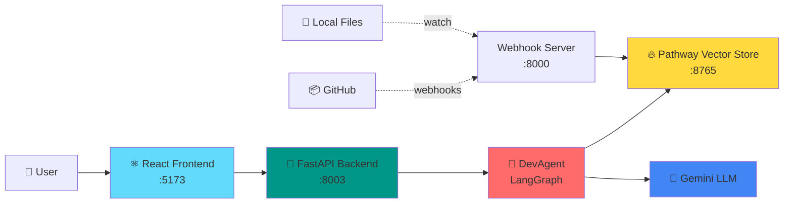
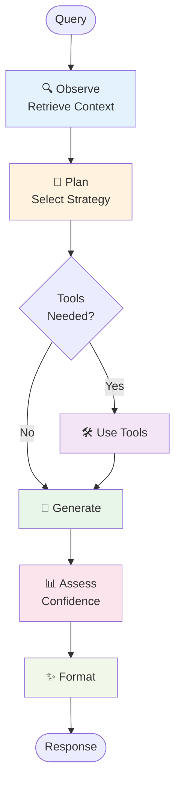
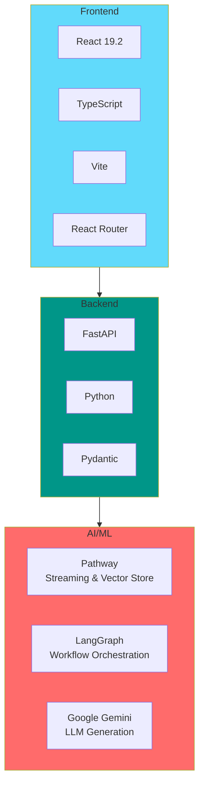
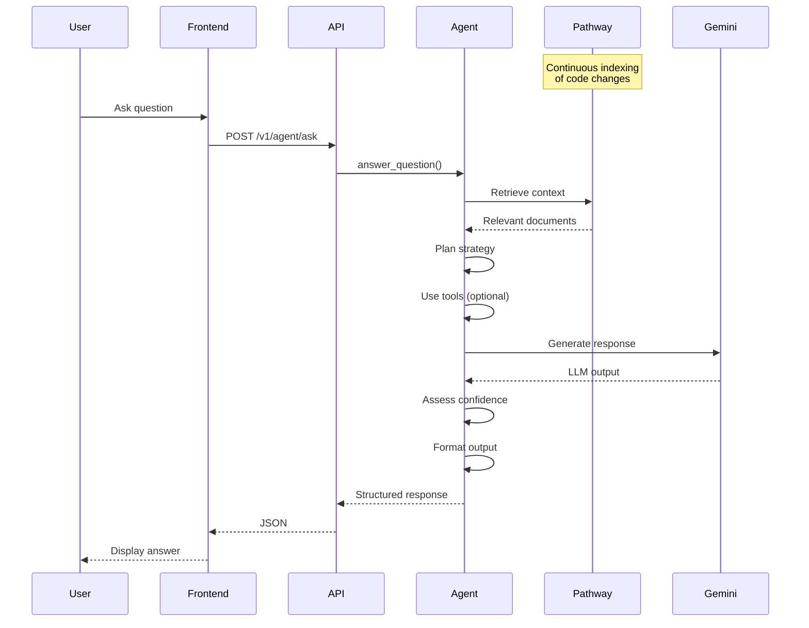

# Quick Mermaid Diagrams Reference

This is a quick reference guide for the Mermaid diagrams in this repository.

## 📚 Full Documentation

See **[ARCHITECTURE.md](./ARCHITECTURE.md)** for complete, detailed diagrams with explanations.

---

## Quick System Overview



---

## Agent Workflow



---

## Technology Stack



---

## Data Flow



---

## Repository Structure

```
Pathway-Hack/
├── backend/
│   ├── main.py                 # FastAPI entry point
│   ├── agent/                  # Agentic reasoning
│   │   ├── agent.py            # LangGraph workflow
│   │   ├── planner.py          # Strategy selection
│   │   ├── tools.py            # Agent tools
│   │   └── confidence.py       # Confidence scoring
│   ├── pathway_engine/         # Core streaming engine
│   │   ├── main.py             # Pathway runtime
│   │   ├── ingestion/          # Data sources
│   │   ├── indexing/           # Vector indexing
│   │   ├── query/              # Retrieval
│   │   └── state/              # Version tracking
│   └── llm/
│       └── gemini_client.py    # LLM client
├── frontend/
│   └── src/
│       ├── pages/              # Dashboard, AskTheAgent, etc.
│       └── components/         # UI components
└── ARCHITECTURE.md             # Full documentation
```

---

## Key Services & Ports

| Service | Port | Purpose |
|---------|------|---------|
| Frontend (Vite) | 5173 | React development server |
| Backend (FastAPI) | 8003 | Agent API endpoints |
| Pathway Vector Store | 8765 | Document retrieval API |
| GitHub Webhook Server | 8000 | Receives GitHub events |

---

## Key Features

🔥 **Live Indexing**: Pathway continuously indexes code changes in real-time

🧠 **Agentic Workflow**: LangGraph orchestrates multi-step reasoning process

📚 **Context-Aware**: Vector search retrieves relevant code snippets

🎯 **Confidence Scoring**: Assesses answer reliability and adds hedge phrases

🤖 **LLM Generation**: Gemini API generates natural language responses

📊 **Source Attribution**: Shows which files and chunks informed the answer

---

## Quick Links

- 📖 [Full Architecture Documentation](./ARCHITECTURE.md)
- 🔙 [Backend README](./backend/README.md)
- 🎨 [Frontend README](./frontend/README.md)

---

## Diagram Formats Supported

All diagrams in this repository use **Mermaid** syntax, which is natively supported by:

- ✅ GitHub
- ✅ GitLab
- ✅ VS Code (with Mermaid extension)
- ✅ Markdown editors
- ✅ Documentation sites (MkDocs, Docusaurus, etc.)

You can also render them online at [mermaid.live](https://mermaid.live/)
