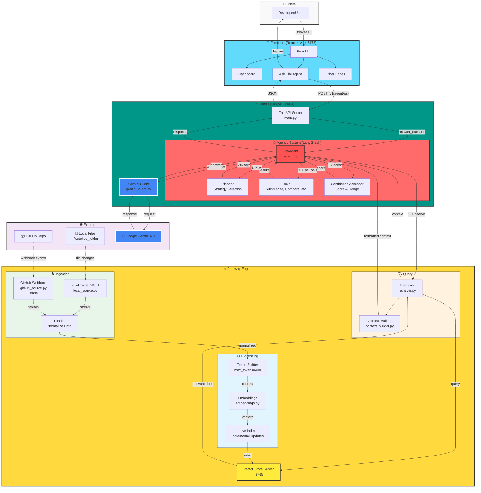

# Pathway-Hack System Architecture

Complete system architecture diagram showing all components, data flow, and interactions.

## Key Components

### Frontend (Port 5173)
- **React + TypeScript** UI with Dashboard, Ask The Agent interface, and monitoring pages
- **Vite** for development and building

### Backend (Port 8003)
- **FastAPI** server exposing agent endpoints
- **LangGraph-based Agent** with multi-step reasoning:
  1. **Observe** - Retrieve relevant context from vector store
  2. **Plan** - Select strategy (direct, summarize, uncertain, compare)
  3. **Use Tools** - Execute tools if needed (summarize, compare, etc.)
  4. **Generate** - Create response using Gemini LLM
  5. **Assess** - Calculate confidence score and add hedge phrases
  6. **Format** - Final output structuring

### Pathway Engine (Port 8765)
- **Live Streaming Pipeline**: Continuous ingestion from local files and GitHub webhooks
- **Incremental Indexing**: Real-time vector embeddings as code changes
- **Vector Store Server**: Fast semantic search for context retrieval
- **GitHub Webhook Server** (Port 8000): Receives repository events

### Data Flow

**Background (Continuous):**
1. Code changes → Ingestion (local/GitHub)
2. Normalization → Token splitting (400 tokens)
3. Embedding generation → Live indexing
4. Vector store updates (incremental)

**User Query:**
1. User asks question → React UI
2. API call → FastAPI Backend
3. DevAgent workflow (6 steps via LangGraph)
4. Context retrieval from Vector Store
5. LLM generation via Gemini
6. Structured response with confidence score
7. Display to user with source attribution

### Technology Stack
- **Frontend**: React 19, TypeScript, Vite, React Router
- **Backend**: Python, FastAPI, Pydantic, LangGraph
- **AI/ML**: Pathway (streaming + vector store), Google Gemini (LLM)
- **Integration**: GitHub webhooks, file system watchers
